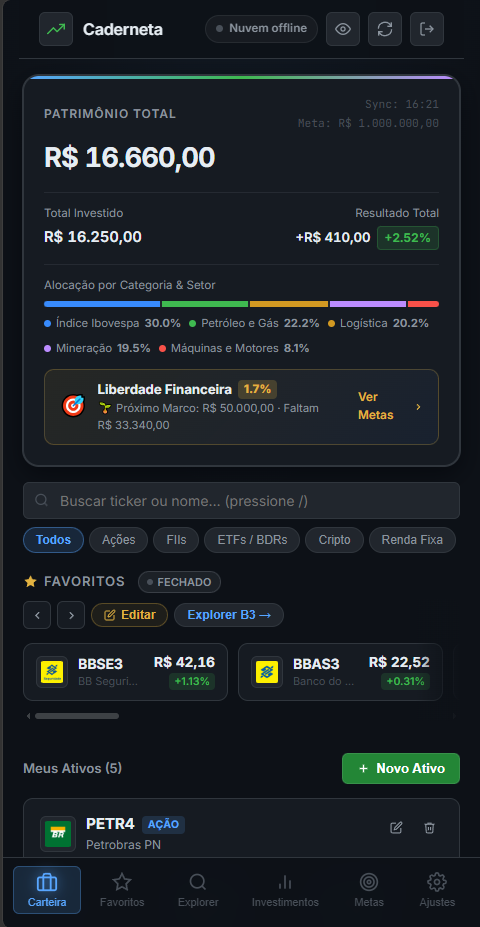
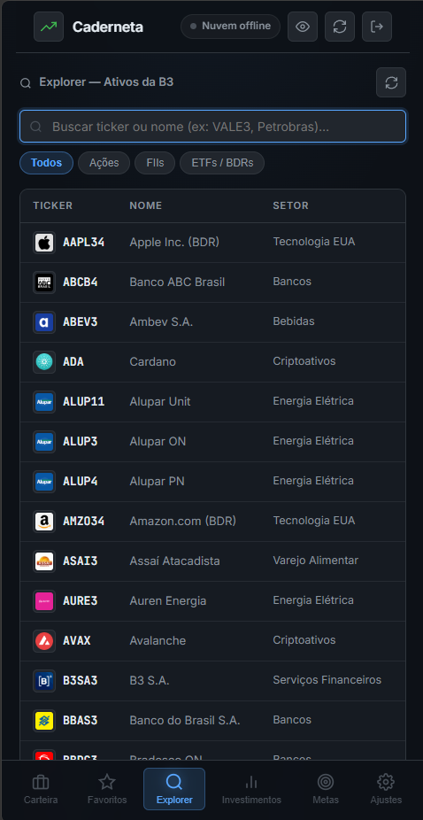
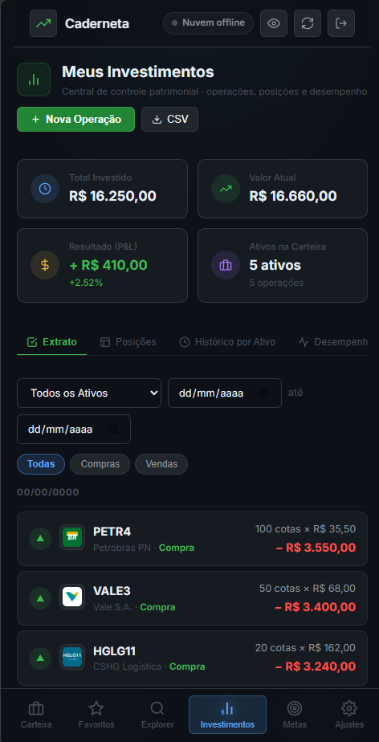

# 📈 Caderneta de Investimentos

> **Controle patrimonial pessoal, privado e inteligente — desenvolvido com o poder da Inteligência Artificial.**

[](#)
[](#)
[](#)
[](#)
[](#)

A **Caderneta de Investimentos** é uma aplicação web progressiva (**PWA**) desenhada para oferecer aos investidores uma experiência completa, limpa e autônoma de acompanhamento patrimonial. Sem custos recorrentes de assinatura e com foco absoluto em privacidade e soberania de dados, o sistema executa 100% no cliente (*client-side*), garantindo que suas informações financeiras jamais fiquem expostas em servidores de terceiros.

---

## 📸 Telas do Sistema

| 01. Tela Inicial | 02. Explorer B3 | 03. Meus Investimentos |
| :---: | :---: | :---: |
|  |  |  |
| *Dashboard patrimonial, meta de aposentadoria e favoritos* | *Rastreador de mercado com cotações e valuation* | *Central de operações, extrato e histórico por papel* |

---

## 🎯 Objetivo do Sistema

A maioria das plataformas modernas de investimento impõe planos pagos, coletas invasivas de dados ou interfaces carregadas de ruídos visuais. A **Caderneta** foi concebida para quebrar esse padrão:

1. **Privacidade e Soberania (Zero-Knowledge):** Os dados da sua carteira pertencem exclusivamente a você. As informações são criptografadas localmente com **AES-256** derivado por **PBKDF2 (150.000 iterações)** antes de qualquer persistência ou sincronização.
2. **Custo Zero Real:** Sem necessidade de servidores dedicados caros. A sincronização em nuvem e pareamento multidispositivo utilizam endpoints seguros de alta performance sem custos para o usuário.
3. **Offline-First & PWA:** Funciona perfeitamente offline no smartphone (Android/iOS) ou desktop, comportando-se como um aplicativo nativo com carregamento instantâneo.
4. **Precisão Financeira:** Aporte e venda registrados com data, cálculo rigoroso de preço médio ponderado e métricas contábeis conforme as regras da B3 e Receita Federal.
5. **Cotações em Tempo Real:** Atualizações diretas para ações brasileiras (B3) e criptomoedas.

---

## 🤖 O Papel da Tecnologia e da Inteligência Artificial

Este projeto é um estudo prático e uma prova cabal da **nova era do desenvolvimento de software orientado por Inteligência Artificial**.

### Da Ideia ao Software em Tempo Recorde
A aplicação foi desenvolvida em regime de **Pair Programming Avançado com I.A.**, demonstrando que **qualquer pessoa ou equipe pode conceber e entregar sistemas de nível profissional**, desde que saiba estruturar comandos com precisão:

* **Arquitetura e Engenharia de Prompts:** O usuário atua como o arquiteto-chefe de produto, fornecendo direcionamentos cirúrgicos, regras de negócio e critérios estéticos refinados.
* **Execução Algorítmica e Matemática:** A I.A. responsabilizou-se pela implementação exata da criptografia de cofre local, cálculos de preço médio ponderado em operações sucessivas, lógica reativa do DOM, Service Workers para cache offline e responsividade *mobile-first*.
* **Refinamento Contínuo e Cirúrgico:** Sem a necessidade de frameworks pesados ou bibliotecas inchadas, cada linha de código JavaScript, CSS e HTML foi esculpida com precisão artesanal sob demanda, adaptando-se instantaneamente a novos requisitos de UX e feedback do usuário.

> 💡 *A I.A. não substitui a visão humana; ela potencializa exponencialmente a capacidade de quem sabe como formular o problema e guiar a solução.*

---

## 🚀 Principais Recursos

### 1. 🏠 Tela Inicial (Dashboard Consolidado)
* **Patrimônio Total & P&L:** Total investido vs. valor atual de mercado com percentuais de lucro/prejuízo atualizados.
* **Metas & Aposentadoria:** Barra de progresso visual rumo à independência financeira e aportes mensais.
* **Alocação por Categoria e Setor:** Distribuição patrimonial em Ações, FIIs, ETFs, Cripto e Renda Fixa.
* **Carrossel de Favoritos:** Acompanhamento rápido com logos oficiais, cotações e variação percentual do dia.

### 2. 🔍 Explorer B3
* **Rastreador de Ações:** Lista completa de ativos da bolsa brasileira com cotações automáticas.
* **Modelos de Valuation Integrados:** Cálculo automatizado de Preço Justo de Graham e Método Bazin.
* **Filtros Avançados:** Filtre por setor, categoria ou variação diária.
* **Adição aos Favoritos em 1 Clique:** Favoritar papéis diretamente com dados pré-carregados.

### 3. 💼 Meus Investimentos (Hub Patrimonial)
* **KPI Cards em Tempo Real:** Total aportado, valor atual, rentabilidade líquida e total de operações.
* **Extrato Cronológico:** Feed histórico de compras e vendas agrupado por datas com filtros por tipo e ticker.
* **Posições Consolidadas:** Tabela detalhada com quantidade de cotas, preço médio, cotação atual e resultado.
* **Histórico Detalhado por Papel:** Visualização de todos os aportes já realizados em um ativo específico.
* **Painel de Desempenho:** Distribuição percentual por categoria, melhores e piores ativos da carteira e resumo analítico.
* **Exportação CSV:** Exportação compatível com Microsoft Excel brasileiro com codificação UTF-8 BOM.

---

## 🛠️ Stack Tecnológica

| Componente | Tecnologia | Finalidade |
| :--- | :--- | :--- |
| **Interface (UI)** | HTML5 Semântico + CSS3 Moderno | Sem frameworks externos, visual clean, variáveis CSS nativas e tema escuro. |
| **Lógica de Negócio** | JavaScript Vanilla (ES6+) | Código limpo, leve e de altíssimo desempenho. |
| **Criptografia** | CryptoJS (AES-256 + PBKDF2) | Segurança Zero-Knowledge com senha/PIN local. |
| **Cotações** | Yahoo Finance Proxy + Binance API | Preços de mercado atualizados sem custos. |
| **PWA & Cache** | Service Worker + Cache Storage | Operação offline contínua e instalação como aplicativo móvel. |
| **Gráficos** | TradingView Widget | Análise gráfica avançada em tempo real no modal de detalhes. |

---

## 💻 Como Utilizar

1. Acesse a aplicação diretamente pelo navegador (hospedada no GitHub Pages) ou clone o repositório localmente:
   ```bash
   git clone https://github.com/davidmp24/caderneta-investimentos.git
   ```
2. Abra o arquivo `index.html` em qualquer navegador web moderno.
3. Defina seu **PIN de acesso** (ele será a chave mestra que criptografa seus dados no dispositivo).
4. No smartphone, clique no menu do navegador e selecione **"Adicionar à tela inicial"** para instalar como PWA.

---

## 📄 Licença

Este projeto é de uso pessoal e educacional, demonstrando as possibilidades da programação assistida por Inteligência Artificial. Sinta-se livre para estudar, clonar e aprimorar.
